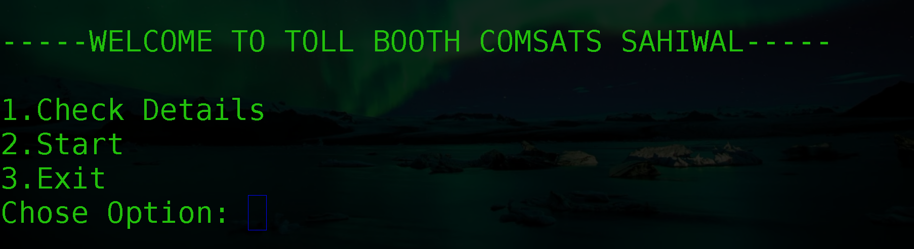
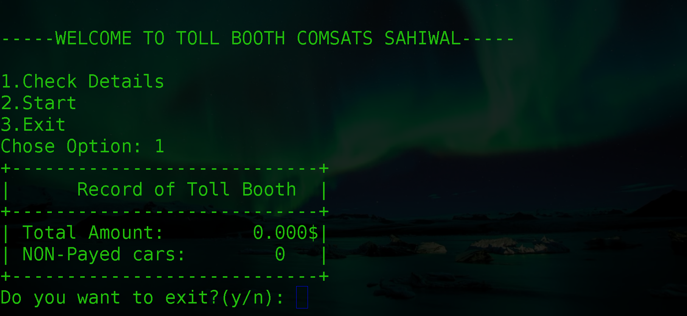

# TollBooth
This is a simple Java-based terminal application designed for toll booth data management. The program tracks vehicles passing through the toll booth, categorizing them based on whether they pay the toll fee of $0.50 or bypass payment. It maintains a count of both paying and non-paying vehicles and calculates the total revenue collected in dollars. Additionally, it provides a summary report displaying the total number of vehicles that passed without paying. This project is a basic implementation of data tracking and financial computation in a toll booth system.

## Software Start
Upon launching the software, the user is presented with three options:
* __Check Detais__ Select this option to view existing records.
* __Start__ Choose this option to add payment and vehicle records.
* __Exit__ Select this option to close the application.  
The user must choose one of these options to proceed
  

## Checking Existing Records
If you want to check the existing records, select __Check Details__  

## Entering new details 
If you want to enter new details of cars passing through the TollBooth, select __Start__
  

